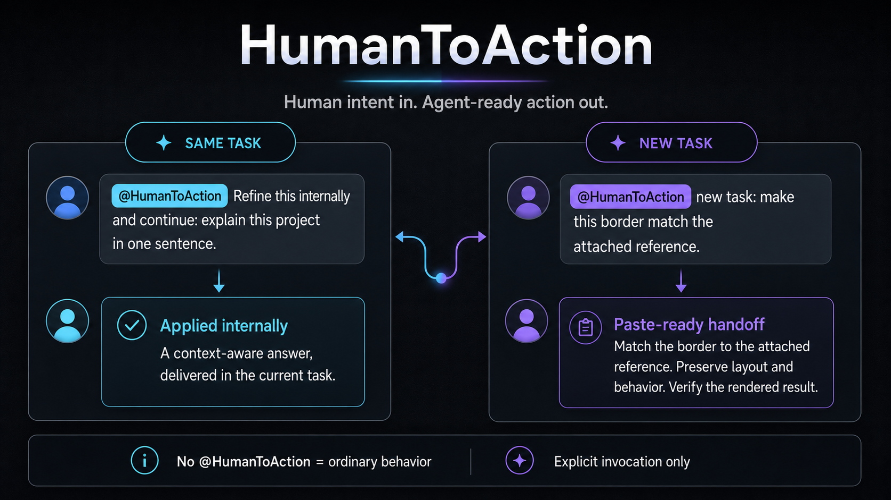

# HumanToAction

**Say it naturally. HumanToAction makes it executable.**

You should not need to write a mini-spec every time you talk to an agent. HumanToAction turns the useful context already in your task into a brief the agent can actually work from.



## What it does

You say:

```text
@HumanToAction Make this border match the attached reference.
```

HumanToAction makes the parts that change the result explicit:

- **Source of truth:** which reference, file, or decision controls the work.
- **Preserve:** what the agent must leave alone.
- **Verify:** how the result should be checked before it is called done.
- **Stop:** where the task ends so it does not grow into something else.

Then it picks the right destination:

- **Same task:** applies the clearer brief internally and keeps working. No copy-and-paste loop.
- **New task, thread, workspace, or handoff:** returns a paste-ready brief carrying the relevant context forward.
- **Prompt audit:** points out contradictions, missing boundaries, and weak completion criteria without rewriting unless asked.

## Use it

Keep working in the current task:

```text
@HumanToAction Refine this internally and continue: make the border match the attached reference.
```

Create a handoff for somewhere else:

```text
@HumanToAction new task: make the border match the attached reference.
```

Audit an agent prompt:

```text
@HumanToAction Audit this prompt without rewriting it.
```

You can also invoke the bundled skill directly:

```text
$human-to-action:refine-agent-prompts
```

## Install

Add the marketplace:

```bash
codex plugin marketplace add The-Tesseract-Team/human-to-action --ref main
```

Install HumanToAction:

```bash
codex plugin add human-to-action@tesseract-team
```

Restart the ChatGPT desktop app and begin a new task so Codex discovers the skill.

## It only shows up when invited

**No `@HumanToAction`, no HumanToAction.**

There is no lifecycle hook watching every message. The plugin contains instructions and reference material—no background process, network access, persistence, telemetry, or prompt logging.

<details>
<summary>Development and project files</summary>

```text
.agents/plugins/marketplace.json   Marketplace catalog
.codex-plugin/plugin.json          Plugin manifest
assets/                             README preview
skills/refine-agent-prompts/       HumanToAction skill
evals/cases.json                   Routing examples
tests/                             Explicit-activation tests
scripts/validate.py                Repository checks
```

```bash
python3 -m venv .venv
source .venv/bin/activate
python -m pip install -r requirements-dev.txt
python scripts/validate.py
python -m unittest discover -s tests -v
```

</details>

## Project links

[Privacy](PRIVACY.md) · [Security](SECURITY.md) · [Contributing](CONTRIBUTING.md) · [Changelog](CHANGELOG.md) · [MIT License](LICENSE) · [Names and attribution](TRADEMARKS.md)
